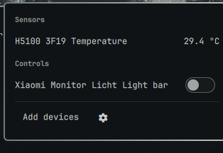

# OmaHome — Home Assistant for Omarchy

Read sensors and control lights, switches, and fans on your Home Assistant
server from the Omarchy bar.

## Install

    omarchy plugin add https://github.com/Zyliax/omahome.git --enable

## Connect to your Home Assistant

1. In Home Assistant, create a token: click your profile (bottom left) →
   **Security** → **Long-lived access tokens** → **Create token**, and copy it.
2. Click the house icon in the Omarchy bar.
3. Enter the address of your server — the same URL you use to open the
   Home Assistant web interface, for example `http://homeassistant.local:8123`
   or `http://192.168.1.10:8123` — and paste the token.
4. Click **Connect**, then pick the devices and sensors you want to see.

Plain HTTP on your local network is fine: requests go only to the address
you enter, nowhere else.

## Usage

- Click the house icon to open the panel; Escape closes it.
- Toggles switch devices on and off. Dimmable lights get a brightness
  slider (drag, or scroll over it).
- Climate entities show the current room temperature, an on/off toggle, and a
  target-temperature slider (drag, or scroll over it) that appears while on.
- **Add devices** reopens the picker. The gear button returns to the
  connection setup, where **Disconnect** deletes the stored token and the
  server address — your device selection is kept for the next connect.
- A device you deleted in Home Assistant stays listed with a **Remove**
  button so you can drop it.

## Remove

    omarchy plugin remove io.github.zyliax.omahome

This does not delete your stored token. Remove it separately:

    rm -r ~/.config/omarchy/homeassistant

## What it does with your data

- Requests go only to the Home Assistant address you configure. Nothing is sent anywhere else.
- Your token is stored in `~/.config/omarchy/homeassistant/auth.header`, mode `600`, in a mode-`700` directory.
- The token is never written to `shell.json` and never appears on a command line, so it cannot be read out of the process list.
- The only external program the plugin uses to talk to Home Assistant is `curl`. Writing and managing the credential file locally (never over the network) uses a handful of standard POSIX utilities: `sh`, `mkdir`, `chmod`, `cat`, `stat`, `mv`, `rm`.

## Supported entities

`light` (on/off and brightness), `switch`, `fan`, `input_boolean`, `sensor`, `binary_sensor`, `climate` (on/off and target temperature).

## Requirements

Omarchy 4 or newer, with `omarchy-shell`.
